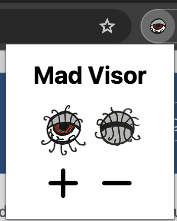

# Mad Visor

Mad Visor is a Chrome extension which improves the usability of websites for sighted people.

It was created by and for [mad](https://www.ncbi.nlm.nih.gov/pmc/articles/PMC6420721/) and [neurospicy](https://www.sugarandsloth.co.uk/blogs/the-bestie-library/what-does-neurospicy-mean) folx.

## What does it do?

Mad Visor shades the current web page, except for a strip which follows your mouse. This helps to reduce distractions so you can more easily focus on specific content.

You can change the size of the transparent strip to view more or less of the page outside of the shaded area (the "visor").

## Screenshots

